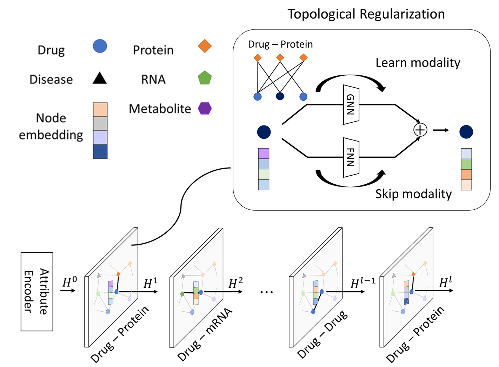

# STRGNN
This repo contains the code and the datasets for our paper "Deep learning of multimodal networks with topological regularization for drug repositioning".

{: align="center"}

# Requirements
STRGNN is tested to work under Python 3.8.
All the required packages can be installed using the following command:

    $ pip install -r requirements.txt

# Quick start
1. Download multimodal network dataset created in this paper.  
[Dataset](https://drive.google.com/drive/folders/1MILzvqiNGdUwE4wbBLSKcmGwZVXyzmhB?usp=sharing)

2. Run <code>main.py</code>  
Options are:  
<code>-g: The cuda devive, default=0</code> 
<code>-type: The link prediction task type, default='transductive'</code> 
<code>-tg: The target network, default='drug_disease'</code> 
<code>-enc: The encoder type, default='MIX'</code> 
<code>-dec: The decoder type, default='IPD'</code> 
<code>-rt: The regularization type, default=1</code> 
<code>-d: The embedding dimension, default=128</code> 
<code>-ls: The embedding loss, default='none'</code> 
<code>-c: The number of cycle, default=2</code> 
<code>-nl: The parameter of normalization lambda, default=1e-6</code> 
<code>-cs: The channel size, default=5</code> 
<code>-ks: The kernel size, default=3</code> 
<code>-s: The stride size, default=2</code> 
<code>-de: The drop edge ratio, default=0.2</code> 
<code>-do: The dropout ratio, default=0.5</code> 
<code>-cv: The number of cross-validation, default=1</code> 
<code>-e: The number of epochs, default=5000</code> 
<code>-v: The number of verbose, default=10</code> 
<code>-save: The parameter to decide save model, default=False</code> 

# Contacts
Please contact me at yuuto.0902@dna.bio.keio.ac.jp for any questions or comments.